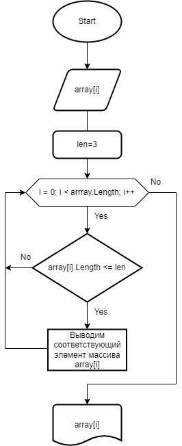

# Итоговая проверочная работа

**Задача:**

Написать программу, которая из имеющегося массива строк формирует новый массив из строк, длина которых меньше, либо равна 3 символам. Первоначальный массив можно ввести с клавиатуры, либо задать на старте выполнения алгоритма. При решении не рекомендуется пользоваться коллекциями, лучше обойтись исключительно массивами.

**Решение задачи:**

1. Создаем массив строк, для этого пользователю необходимо ввести данные.
2. Пользователь вводит произвольно длину массива.
3. Пользователь пошагово вводит каждый элемент массива.
4. Программа выводит созданный пользователем массив строк.
5. Берем массив строк и проверяем длину каждого элемента массива.
6. По условию длина каждого элемента массива должна быть меньше либо равна 3 символам.
7. Если условие соблюдено наш элемент массива записывается в новый массив.
8. Если условие не соблюдено переходим к следующему элементу массива.
9. По окончанию выводим наш массив на экран.

**Решение задачи в виде блок-схемы:**

